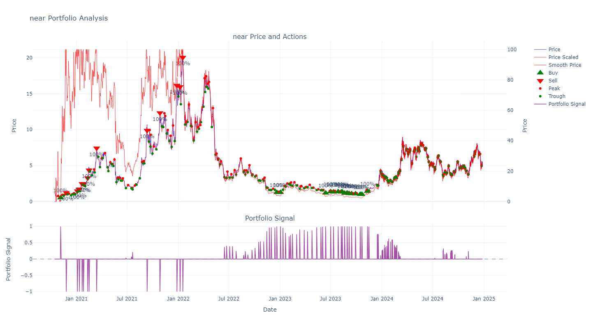
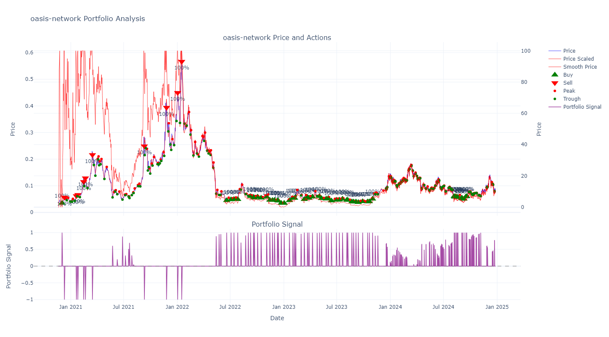

# Crypto Trading Signals Generator

A simple system for generating cryptocurrency trading signals based on technical analysis while avoiding forward bias.

1. Gets the price data from the coingecko api. Also gets current market data.
2. Uses a savitzky-golay filter to smooth the price data and detect peaks and troughs.
4. Generates buy/sell signals based on ATH (All-Time High) prices, peaks and troughs.
5. Tracks token prices and major swings in price and alerts.
6. Important metrics are visualized in Plotly to aid decision making.

# Important Features

1. Minimal forward-looking bias in calculations (sell signal generated for time t set atmost at t+2 hours)
2. Data updated every hour.
3. Proper frequency handling (daily/hourly).
4. State management for portfolio tracking
5. Automated notifications via Telegram for:
6. Key indicators tracked per token:
   - Raw price and volume
   - 0-100 normalized price (expanding window)
   - Savitzky-Golay smoothed price
   - Peak/trough detection
   - Portfolio state
7. Market-wide metrics:
   - Alt market cap and dominance
   - Total volume percentiles
   - Historical rankings

# Sample Visualization

### Near token Price and Signals

### Oasis token Price and Signals

